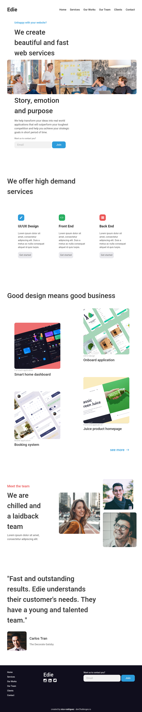
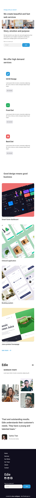

<h1 align="center">Edie Homepage</h1>

   Solution for a challenge from  <a href="http://devchallenges.io" target="_blank">Devchallenges.io</a>.

  <h3>
    <a href="https://edie-homepage-7509e4.netlify.app/">
      Solution
    </a>
     | 
    <a href="https://devchallenges.io/challenges/xobQBuf8zWWmiYMIAZe0">
      Challenge
    </a>
  </h3>

## Overview

Visit [https://edie-homepage-7509e4.netlify.app/](https://edie-homepage-7509e4.netlify.app/).

Desktop

Mobile

## Features

This application/site was created as a submission to a [DevChallenges](https://devchallenges.io/challenges) challenge. The [challenge](https://devchallenges.io/challenges/xobQBuf8zWWmiYMIAZe0) was to build an application to complete the given user stories.

The header is responsive to the width of the device, hiding the menu links with `display: none` on small screen devices. It displays the hamburger menu by re-arranging the header elements, through CSS and a little of JS, re-utilizing the DOM elements.

The cards in the Services section are animated.

All images are responsive.
